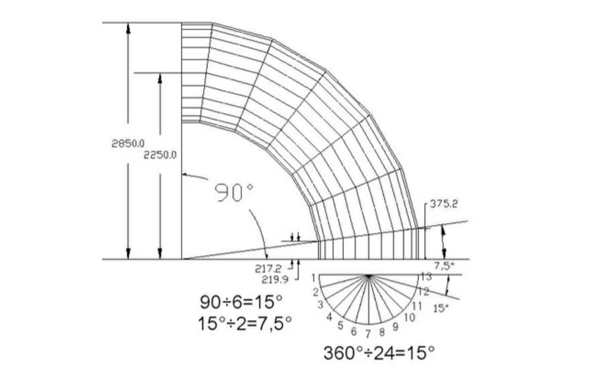
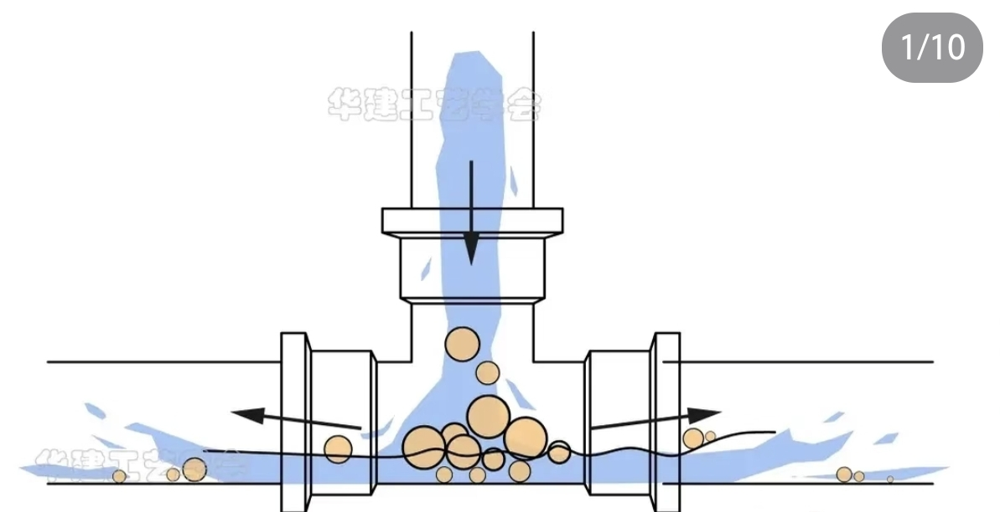

## Issue 基本信息

**Issue ID：** 
- `5`

**Issue 类型（Issue Type）：**  
- `Design`
说明：
- 当前字段表示本 Issue 所承载的真实工作流节点名，不是装饰性分类标签

**当前状态：**  
- `draft`

**状态候选值：**
- `draft`
- `active`
- `blocked`
- `pending-decision`
- `closed`

**负责人：**  
- 陈康

**指导人：**
- 魏华祎

**协作者（按需填写）：**
- 汪文彬

**时间盒：**  
- 2026.3.12 — 2026.3.18

**开工分支：**  
- `design/issue-5-hydraulic-pipe-geometry-mesh-program-design`

**相关 Model / Workflow / Template / Contract 引用（按需填写）：**
- `suanhai/template/issue/suanhai_issue_main_template.md`
- `kb/requirements/tiangong_hydraulic_pipe_fsi_optimization_scenario_requirement.md`

## 二、创建缘由与目标边界

### 创建缘由

Issue #18 已明确液压管件流固耦合优化场景的工程需求，其中包括：
- 90°高压弯管优化 (单弯头)  
管径规格：内径 D=25mm (对应 DN25 高压管) 弯角：固定 90∘ 直管段延伸：入口前 5D ，出口后 10D(确保流动充分发展) 初始设计：弯曲半径 R=1.5D ($37.5 mm $ )。

管子的内径是25mm 在弯道前是125mm长 弯道后是250mm长这个都不包含弯道的尺寸；弯曲半径指的是内弯，外弯可以根据壁厚内径计算出来。这个弯道是四分之圆(因为是90℃弯)。

- 90°分流三通优化 (单三通)
主管内直径： Dmain=32mm(对应 DN35 高压管) 支管内直径： Dbranch=25mm(对应 DN25 高压管) 夹角：90∘ (正交三通) 流动方向：主管流入，支管分流 (或合流，视具体配置，默认分流) 初始设计：支管过渡圆角 R=0.5D 直管段延伸：入口前 5D ，出口后 10D(确保流动充分发展)。

两根支管内径比主管小。主管与支管连接处有圆弧过度，如果没有圆弧过度，会产生应力。圆弧过渡的那个弧的半径是12.25mm

在液压管件流固耦合优化场景中，仿真流程通常包括以下阶段：geometry modeling → mesh generation → simulation。

在进入几何建模与网格生成模块实现之前，需要首先明确：
- 几何建模接口设计
- 网格生成接口设计
- 参数化几何设计方式
- 几何与网格之间的数据流

因此创建本 Issue，用于完成 **几何与网格相关接口设计**，为后续模块实现提供统一的接口基础。

### 当前承载问题

当前系统中尚未明确以下关键设计：
- 几何建模模块的对外接口
- 网格生成模块的接口定义
- 几何参数与优化变量之间的映射关系
- 几何模型与网格模块之间的数据传递方式

如果缺乏这些设计，可能导致：
- 几何模块与网格模块难以协同开发
- 参数化优化流程难以建立
- 数据结构在模块之间不兼容

### 目标
本 Issue 需要完成以下设计内容：
1）几何建模接口设计 
设计几何模块的对外接口。
接口目标：将 **参数化设计变量** 转换为 **几何模型**。
该接口应保持 **通用结构**，但参数可以根据液压管件场景进行扩展。

2）网格生成接口设计
设计网格模块的接口。
接口目标：将 **几何模型** 转换为 **计算网格**。
生成网格需要满足后续 CFD、FEA、FSI 计算需求。
模块之间的数据关系：geometry_module → mesh_module → solver。

需要明确：
- geometry_model 的数据格式
- mesh 数据结构
- 模块之间的数据传递方式

### 非目标
本 Issue 不包含以下工作：
- 几何建模程序实现
- 网格生成程序实现
- 网格生成算法开发
- 仿真求解器开发
本 Issue 仅关注 **接口与数据流设计**。

## 三、范围、依赖与约束

### 工作范围
- 几何建模接口设计
- 网格生成接口设计
- 参数化几何设计方案

### 前置依赖
- Issue：https://github.com/suanhaitech/tiangong/issues/18

### 外部约束或限制
- 程序结构需适配天工 CAX 工作流平台  
- 几何与网格模块需支持参数化优化计算  

### 当前不确定因素
- 几何模块实现方式  
- 网格模块所使用的算法或工具  

## 四、完成定义与风险

### 完成定义（DoD）

满足以下条件时，本 Issue 可关闭：
- 完成几何模块接口设计
- 完成网格模块接口设计 
- 形成接口设计文档
文档路径：`docs/design/fealpy_hydraulic_pipe_geometry_mesh_interface_design.md`

### 最小可接受结果
- 几何模块接口定义
- 网格模块接口定义
- geometry → mesh 数据流说明

### 主要风险
- 模块接口设计不合理影响后续开发 
- 参数化几何设计不足以支持优化流程
- 几何模型与网格模块之间数据结构不兼容

### 回退或止损方式
若当前接口设计不适合后续开发：
- 可采用简化接口重新设计
- 先建立最小可运行的 geometry → mesh 流程

## 五、Gate System 概览

本 Issue 涉及以下关键 Gate：
### 当前关键 Gate
- `geometry-interface-defined`
- `mesh-interface-defined`
- `geometry-mesh-dataflow-defined`

### 当前关键判断概览
本 Issue 的核心目标是完成液压管件几何建模与网格生成模块的设计，而不是直接进行实现。在 Gate 评审阶段，需要重点判断以下内容：
- 几何建模模块与网格生成模块的接口定义是否清晰
- 网格生成策略（如自动网格划分、结构化网格等）是否适合当前场景
- 几何建模模块与网格生成模块之间的耦合关系是否合理
- 数据交换接口是否清晰，确保几何数据能顺利流入网格生成模块
- 模块的可扩展性与可实现性是否符合需求
只有在上述关键判断成立时，该 Issue 才可以进入几何建模与网格生成模块的实现阶段。

### 当前主要缺口
当前阶段仍存在以下主要缺口：
- 尚未形成完整的几何建模与网格生成模块设计文档
- 数据流与接口定义尚未最终确认
- 几何建模模块与网格生成模块的耦合关系需进一步明确
- 网格生成算法与策略尚未优化并明确
- 计算流程尚未系统化描述

### 知识抽取检查概览
当前阶段主要进行几何建模与网格生成算法设计知识的结构化整理，目标是将相关算法设计过程沉淀为标准算法文档，并纳入知识库。该过程包括：
- 几何建模与网格生成的数学模型说明
- 数据流与接口的整理
- 算法设计结构说明

### 知识抽取相关关键入口
`docs/design/fealpy_hydraulic_pipe_geometry_mesh_interface_design.md`

### 知识抽取缺口或待补动作
- 补充几何建模与网格生成的数学模型说明
- 完善数据流与接口设计
- 明确网格生成策略和优化方法
- 完善耦合模块接口的描述

### 当前关键 Gate 文件入口
- `kb/issues/5/gate/decision.md`
- `docs/design/fealpy_hydraulic_pipe_geometry_mesh_interface_design.md`

## 六、后续动作与待确认项
### 建议下一动作
- 几何建模模块实现 Issue
- 网格生成模块实现 Issue 

### 待确认项
暂无